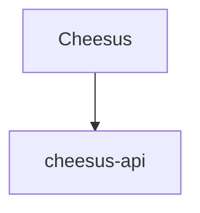

# 🧀 Cheesus

Welcome! Cheesus is simple CRUD app for showing available cheeses that we have in our physical store. Who knows - maybe we'll accept and extend to payments.

## 📋 Still Todo before we can consider production ready
- Authentication
- Metrics capture (Cloudwatch logs could do for now if we deploy via AWS)
- Actual deployment code (terraform/pulumi/CloudFormation)
- CDN setup/Load Balancing/Route53 domain setup

## 📁 Project Structure

## 🏃 How to run the project
- Clone the project (TODO: thegithuburl when we get this)

### Locally
- Ensure you have [nvm](https://github.com/nvm-sh/nvm) installed to ensure you have the correct node version

### With Docker
- Ensure you have [Docker](https://docs.docker.com/get-docker/) installed.

## ⛙ CI/CD
- Github actions is used for CI (not yet CD)
- We have a workflow that runs on every push for the following steps for api, frontend and contracts
  - build
  - typecheck
  - test

## 👋 Questions?
- Questions/Feedback is very welcome. Leave me an issue here (TODO: Github project link ) and I'll get back to you as soon as I can.