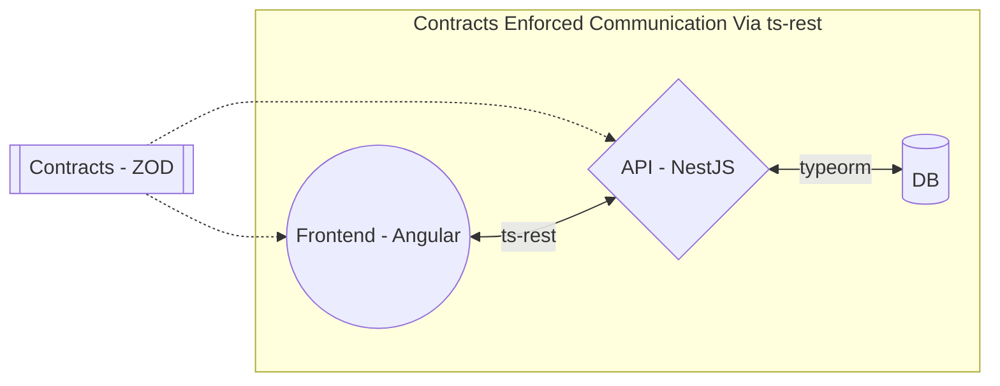

# 🧀 Cheesus

Welcome! Cheesus is simple CRUD app for showing available cheeses that we have in our physical store. Who knows - maybe we'll accept and extend to payments.


## 🏛️ Architecture



## 🏃 How to run the project
- Clone the project at https://github.com/wlee88/cheesus
### Locally
- Ensure you have installed:
  - [nvm](https://github.com/nvm-sh/nvm) to ensure you have the correct node version
  - [yarn](https://classic.yarnpkg.com/en/docs/install) to manage the packages
  - [Docker](https://docs.docker.com/get-docker/) to have a DB running.

- Run `nvm install` to ensure you have the correct node version.
- Run `yarn` to install the packages.
- Start a local DB
```
docker run --name cheesus-db-local -e POSTGRES_USER=master -e POSTGRES_PASSWORD=password -e POSTGRES_DB=cheesus -p 5432:5432 -d postgres
```
- Run `yarn start:api` - Available at http://localhost:3000
- Run `yarn start:frontend` Available at Frontend - Available at http://localhost:4200

### docker-compose
- Ensure you have [Docker](https://docs.docker.com/get-docker/) installed.
- Run `docker-compose -f docker-compose.yml up`
- API available at http://localhost:3000
- Frontend available at http://localhost:4200

## 📁 Project Structure
## 📦 Packages
- [@cheesus/api](packages/api/README.md) - The API for the Cheesus project. It is built using the NestJS framework. Simply reads the types from contracts and services appropriately.
- [@cheesus/frontend](packages/frontend/README.md) - The frontend for the Cheesus project. It is built using Angular.
- `@cheesus/contracts` - The contracts for the Cheesus project. It is built using TypeScript and Zod for validation. Contains all the shared DTOs and validation for the API and Frontend.

## 🤝 Cross Repo communication
- `@cheesus/contracts` - contains all shared contracts and validations for the API and Frontend (defined using [Zod](https://zod.dev/)).
- [ts-rest](https://ts-rest.com/) reads the contracts and generates a type safe client for the API and Frontend.
  - This allows us to make changes to the API and have immediate feedback in the frontend.
  - **note**: contract changes require a `yarn build:contracts` currently when there are any changes.

## ⛙ CI/CD
- Github actions is used for CI
- There is a [workflow](https://github.com/wlee88/cheesus/actions) that runs on every push to `main` branch for the following steps for api and frontend.
  - build
  - test

## 🚢 Port Reservations
### Production
- DB: `5432`
- API: `3000`
- Frontend: `4200`
### Test
- DB: `5433`

## 📋 Still Todo before we can consider production ready
- Integration tests - that run against the API through to DB
- End to End tests - that run against the frontend through to the API
- Authentication/admin area
- Metrics/logs capture (Cloudwatch logs could do for now if we deploy via AWS)
- Healthcheck API route/Actual deployment and code (terraform/pulumi/CloudFormation)
- Github Workflow for deployment
- CDN setup/Load Balancing/Route53 domain setup

# 😮 Troubleshooting

## It's not detecting @cheesus/contract import changes

Ensure the changes are built with `yarn build:contracts`. 

## Unable to connect to the database.
- The error might look like this:
```bash
[Nest] 8824  - 04/20/2024, 2:19:57 PM   ERROR [TypeOrmModule] Unable to connect to the database. Retrying (1)...
AggregateError
    at internalConnectMultiple (node:net:1116:18)
    at afterConnectMultiple (node:net:1683:7)

```
- Ensure the DB is running and the connection string is correct in the `.env` file


## 👋 Questions?
 [Submit an issue](https://github.com/wlee88/cheesus/issues) and i'll answer when i can.