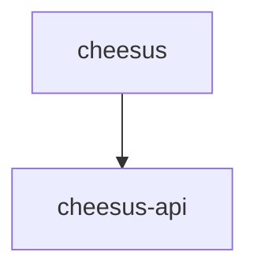

# 🧀 Cheesus

Welcome! Cheesus is simple CRUD app for showing available cheeses that we have in our physical store. Who knows - maybe we'll accept and extend to payments.

## 📋 Still Todo before we can consider production ready
- Authentication
- Metrics capture (Cloudwatch logs could do for now if we deploy via AWS)
- Actual deployment and code (terraform/pulumi/CloudFormation) - we have a healthcheck we can use to check. 
- CDN setup/Load Balancing/Route53 domain setup

## 📁 Project Structure

## 🏃 How to run the project
- Clone the project (TODO: thegithuburl when we get this)

### Locally
- Ensure you have installed:
  - [nvm](https://github.com/nvm-sh/nvm) to ensure you have the correct node version
  - [yarn](https://classic.yarnpkg.com/en/docs/install) to manage the packages
  - [Docker](https://docs.docker.com/get-docker/) to have a DB running.

- Start the DB
- Start the API
  - Available at http://localhost:3000
- Start the Frontend
  - Available at http://localhost:4200

### docker-compose
TODO: make working.. struggling with shared contracts atm
- Ensure you have [Docker](https://docs.docker.com/get-docker/) installed.
- Run `docker-compose -f docker-compose.yml up`
- API available at http://localhost:3000
- Frontend available at http://localhost:4200

## ⛙ CI/CD
- Github actions is used for CI (not yet CD)
- We have a workflow that runs on every push for the following steps for api, frontend and contracts
  - build
  - typecheck
  - test

## Port Reservations

### Production
- DB: 5432
- API: 3000
- Frontend: 4200

### Test
- DB: 5433

## 👋 Questions?
- Questions/Feedback is very welcome. Leave me an issue here (TODO: Github project link ) and I'll get back to you as soon as I can.